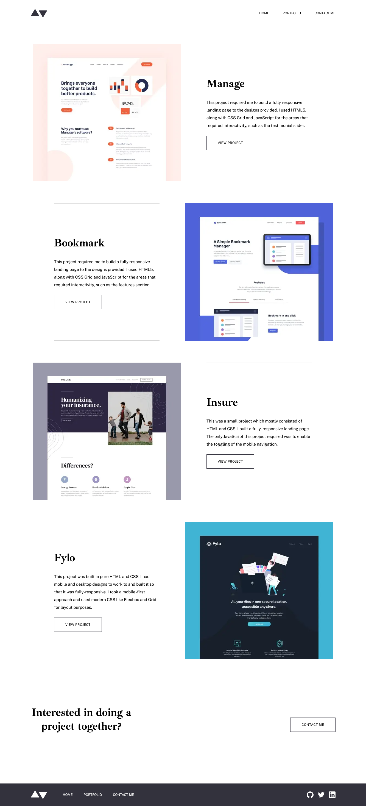
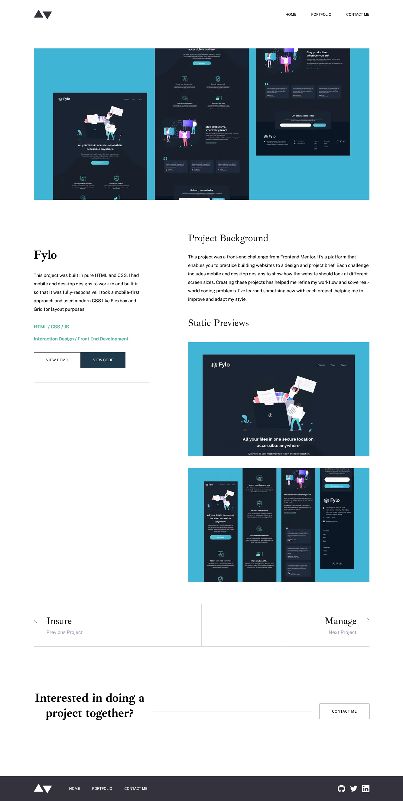
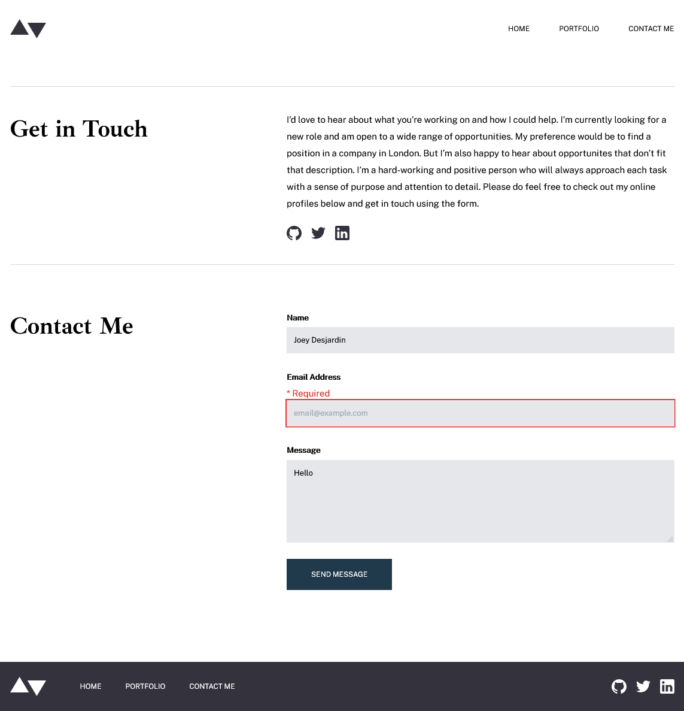

# Frontend Mentor - Minimalist portfolio website solution

This is a solution to the [Minimalist portfolio website challenge on Frontend Mentor](https://www.frontendmentor.io/challenges/minimalist-portfolio-website-LMy-ZRyiE). Frontend Mentor challenges help you improve your coding skills by building realistic projects.

## Table of contents

- [Overview](#overview)
  - [The challenge](#the-challenge)
  - [Screenshot](#screenshot)
  - [Links](#links)
- [My process](#my-process)
  - [Built with](#built-with)
  - [What I learned](#what-i-learned)
  - [Continued development](#continued-development)
  - [Useful resources](#useful-resources)
- [Author](#author)
- [Acknowledgments](#acknowledgments)

**Note: Delete this note and update the table of contents based on what sections you keep.**

## Overview

### The challenge

Users should be able to:

- View the optimal layout for each page depending on their device's screen size
- See hover states for all interactive elements throughout the site
- Click the "About Me" call-to-action on the homepage and have the screen scroll down to the next section
- Handle validation and collection of data from the contact form into JSON :
  - The `Name`, `Email Address` or `Message` fields are empty should show "This field is required"
  - The `Email Address` is not formatted correctly should show "Please use a valid email address"
-

### Screenshots






### Links

- Solution URL: [Add solution URL here](https://github.com/jwdesjardin/minimal-portfolio)
- Live Site URL: [Add live site URL here](https://your-live-site-url.com)

## My process

### Notable Tech-Stack Components

- [Tailwind CSS](https://tailwindcss.com)
- [React](https://reactjs.org/) - JS library
- [Next.js](https://nextjs.org/) - React framework
- [Typescript](https://typescriptlang.org)

### What I learned

#### Typescript Data structure of Projects

The data for the projects were stored in a seperate typescript file. The data types are declared so that i have a refrence for creating another reocrd or using the data. I like this approach because if i wanted to add another project to my application all i need to do is add another entry to the `Projects` array.

```ts
export interface ProjectData {
	slug: string
	heroImage: string
	previewImage: string
	images: string[]
	title: string
	description: string
	development_topics: string[]
	stack: string[]
	code_url?: string
	demo_url?: string
	background: string[]
}

export const Projects: ProjectData[] = [
	{
		slug: 'manage',
		heroImage: '/images/detail/desktop/image-manage-hero.jpg',
		previewImage: '/images/portfolio/desktop/image-portfolio-manage.jpg',
		images: [
			'/images/detail/desktop/image-manage-preview-1@2x.jpg',
			'/images/detail/desktop/image-manage-preview-2@2x.jpg',
		],
		title: 'Manage',
		description: `This project required me to build a fully responsive landing page to the designs
    provided. I used HTML5, along with CSS Grid and JavaScript for the areas that
    required interactivity, such as the testimonial slider.`,
		development_topics: ['Interaction Design', 'Front End Development'],
		stack: ['HTML', 'CSS', 'JS'],
		code_url: '',
		demo_url: '',
		background: [
			`This project was a front-end  challenge from Frontend Mentor. It’s a platform that
      enables you to practice building websites to a design and project brief. Each challenge
      includes mobile and desktop designs to show how the website should look at different
      screen sizes. Creating these projects has helped me refine my workflow and solve
      real-world coding problems. I’ve learned something new with each project, helping
      me to improve and adapt my style.`,
		],
	},
```

#### Use `getStaticPaths` and `getStaticProps` for static page state

`getStaticPaths` and `getStaticProps` are two functions included in the Next.js framework that you can use to deignate a page to be statically genereated. The `getStaticProps` function will run server side at build time and will generate the props for each page that is generated. The props are store as JSON and passed into the page as props when the page is requested. The `getStaticPaths` can be called from a template page that uses a page name like `[slug].tsx`. In these types of pages the `getStaticPaths` function will run once again at build time and will return an array with the parameters for each path that needs to be generated. The parameters for each path are passed to the `getStaticProps` to be used when gettin the props for that path.

More about these function can be read about [here](https://nextjs.org/docs/basic-features/data-fetching) on the Next.js docs.

In my project i used `getStaticProps` and `getStaticPaths` to generate pages for each of my project pages. I brought in the data as an array that was declared in a seperate Typescript file. I read through the array of projects and mapped the parameters using `getStaticPaths` then used `getStaticProps` to find the data for the current project as well as the projects before and after in sequence for navigation purposes.

```tsx
import { Projects } from '../../data'
import { InferGetStaticPropsType } from 'next'

export async function getStaticPaths() {
	const paths = Projects.map((project) => ({
		params: { slug: project.slug },
	}))

	return { paths, fallback: false }
}

export async function getStaticProps({ params }) {
	const data = Projects.find((project) => project.slug === params.slug)
	const index = Projects.findIndex((project) => project.slug === params.slug)
	const total = Projects.length - 1

	const previousIdx = index - 1 > -1 ? index - 1 : total
	const nextIdx = index + 1 > total ? 0 : index + 1
	console.log(previousIdx, nextIdx)
	return {
		props: {
			data,
			previous: Projects[previousIdx] || null,
			next: Projects[nextIdx] || null,
		},
	}
}

export default function Project({
	data,
	previous,
	next,
}: InferGetStaticPropsType<typeof getStaticProps>) {
	return (
```

#### Formik form validation and form submission

Formik is an open source library for creating React forms. It handles the management of state, validation and form submission for you which makes a lot of the boilerplate much easier to handle for the developer. I used it in my project to handle validating the user input in the contact form, including showing custom error state, error messages. The data was also collected into a JSON object to make sending this data to a backend simple.

```tsx
<Formik
	initialValues={{ name: '', email: '', message: '' }}
	validate={(values) => {
		const errors: { name?: string; email?: string; message?: string } = {}
		if (!values.name) {
			errors.name = '* Required'
		} else if (!values.email) {
			errors.email = '* Required'
		} else if (!values.message) {
			errors.message = '* Required'
		} else if (!/^[A-Z0-9._%+-]+@[A-Z0-9.-]+\.[A-Z]{2,}$/i.test(values.email)) {
			errors.email = '* Invalid email address'
		}
		return errors
	}}
	onSubmit={(values, { setSubmitting }) => {
		console.log('submit')
		setTimeout(() => {
			alert(JSON.stringify(values, null, 2))
			setSubmitting(false)
		}, 400)
	}}
>
	{({
		values,
		errors,
		touched,
		handleChange,
		handleBlur,
		handleSubmit,
		isSubmitting,
		/* and other goodies */
	}) => (
		<form action='' onSubmit={handleSubmit} className='xl:w-7/12'>
			<label className='input-label' htmlFor='name'>
				Name
			</label>
			{errors.name && touched.name && <ErrorText>{errors.name}</ErrorText>}
			<input
				type='text'
				name='name'
				onChange={handleChange}
				onBlur={handleBlur}
				value={values.name}
				className={errors.name && touched.name ? 'input error-outline' : 'input'}
				placeholder='Jane Appleseed'
			/>

			<label className='input-label' htmlFor='email'>
				Email Address
			</label>
			{errors.email && touched.email && <ErrorText>{errors.email}</ErrorText>}
			<input
				type='email'
				name='email'
				onChange={handleChange}
				onBlur={handleBlur}
				value={values.email}
				className={errors.email && touched.email ? 'input error-outline' : 'input'}
				placeholder='email@example.com'
			/>

			<label className='input-label' htmlFor='name'>
				Message
			</label>
			{errors.message && touched.message && <ErrorText>{errors.message}</ErrorText>}
			<textarea
				rows={5}
				name='message'
				onChange={handleChange}
				onBlur={handleBlur}
				value={values.message}
				className={errors.message && touched.message ? 'input error-outline' : 'input'}
				placeholder='How can I help?'
			/>

			<button type='submit' disabled={isSubmitting} className='secondary-button'>
				Send Message
			</button>
		</form>
	)}
</Formik>
```

#### Component Props with Typescript

In previous projects i have used the `React.FC<Props>` method of typing my React components. while this has worked for me i read that is it a better practice to type your components more specifically. By doing this you do not add the sumbission of children by defualt and can therefore create components that are better typed for your specific use case.

```tsx
export const LogoSVG = ({
	fillColor = '#33323D',
	className,
}: {
	fillColor: string
	className?: string
}) => {
	return (
		<svg
			className={className ? className : ''}
			xmlns='http://www.w3.org/2000/svg'
			width='61'
			height='32'
		>
			<path
				fill={fillColor}
				fillRule='evenodd'
				d='M60.082 5.878L44.408 32 28.735 5.878h31.347zM15.673 0l15.674 26.122H0L15.673 0z'
			/>
		</svg>
	)
}
```

#### TailwindCSS config File

I used the TailwindCSS config file to start to transfer over some of the values that were going to be used throughout the project. I added in font-family, font-size, screen breakpoints and colors.

```json
module.exports = {
	mode: 'jit',
	purge: ['./pages/**/*.{js,ts,jsx,tsx}', './components/**/*.{js,ts,jsx,tsx}'],
	darkMode: false, // or 'media' or 'class'
	theme: {
		fontFamily: {
			sans: ['Public Sans', 'sans-serif'],
			serif: ['Ibarra Real Nova', 'serif'],
		},
		fontSize: {
			xxs: '12px',
			xs: '15px',
			sm: '16px',
			md: '32px',
			lg: '40px',
			xl: '50px',
		},
		screens: {
			md: '768px',
			lg: '976px',
			xl: '1110px',
			xxl: '1190px',
		},

		extend: {
			colors: {
				myCyan: {
					500: '#5FB4A2',
				},
				myBlue: {
					700: '#203A4C',
				},
				myGrey: {
					100: '#EAEAEB',
					300: '#D7D7D7',
					700: '#979797',
					900: '#33323D',
				},
				myRed: {
					600: '#F43030',
				},
			},
		},
	},
```

#### Tailwind utilty classes with @apply

This was the first project that i have used tailwind css and have been on a bit of a learning curve. I have been wanting to find ways to extract components and resuse styles with tailwind. In places that i was reusing styles i combined tailwind classes into a css class using the `@apply` decorator. I did this for buttons, typography, common layout classes and inputs. Using these classes and some margin spacing classes here and there allowed me to build most of this project.

```scss
@layer components {
	.primary-button {
		@apply border-myGrey-900 px-10 py-4 border uppercase text-xxs tracking-wider hover:bg-myGrey-900 hover:text-white transition-all;
	}
	.secondary-button {
		@apply text-xxs border uppercase text-white py-4 px-10 border-myBlue-700 bg-myBlue-700 hover:bg-myCyan-500 hover:border-myCyan-500 disabled:bg-myGrey-300 disabled:border-myGrey-300 transition-all;
	}
	.menu-button {
		@apply py-6 border-b-4 border-myCyan-500 flex-center cursor-pointer hover:bg-myGrey-700 hover:border-myGrey-700;
	}
	.menu {
		@apply absolute right-10 top-20 w-1/2 bg-myGrey-900 border-collapse z-50;
	}
	.hero-psuedo {
		@apply absolute bottom-0 left-0 w-9/12 bg-white lg:w-7/12 xl:w-4/12;
	}
}

@layer utilities {
	// Layout
	.flex-center {
		@apply flex flex-col items-center justify-center;
	}
	.content-container {
		@apply mx-8 md:mx-10 xl:max-w-screen-xl xl:mx-auto;
	}
	.section-border-y-grey {
		@apply border-t border-b border-myGrey-300;
	}

	// Typography
	.heading-text {
		@apply text-lg font-serif font-bold;
	}
	.heading-text-thin {
		@apply text-lg font-serif;
	}
	.heading-text-thin-md {
		@apply text-md font-serif;
	}
  ...
```

#### Tailwind psuedo selectors

To get all the functionality of tailwind you need to use psuedo selectors. In this project i used psuedo selectors for responsivness and interations like hover and foucus. This allowed me to achieve what i need in this project. I did try using psuedo selectors like \_first and :last and was having trouble but after reading more i noticed that theses are not included by defualt but that if you can turn them on by going into the `tailwind.confing.js` file and adding `variants > extend > textColor: ['first', 'last']`.

### Continued development

#### Tailwind Config file

Adding more values - spacing, borderRadius
Adding defaults

#### Tailwind abstracting components

classes for typography, buttons, layout, badges
components for modals

#### Tailwind psuedo selectors

animation fun - rotaion

### Useful resources

- [Tailwind Docs](https://tailwindcss.com) - This helped me for XYZ reason. I really liked this pattern and will use it going forward.
- [Formik Docs](https://formik.org/docs/overview) - This is an amazing article which helped me finally understand XYZ. I'd recommend it to anyone still learning this concept.
- [Next.js Docs](https://nextjs.org/docs) - This is an amazing article which helped me finally understand XYZ. I'd recommend it to anyone still learning this concept.

## Author

- Website - [Joey Desjardin](https://www.joeydesjardin.com)
- Frontend Mentor - [@jwdesjardin](https://www.frontendmentor.io/profile/jwdesjardin)
- Twitter - [@joey_desjardin](https://twitter.com/joey_desjardin)
